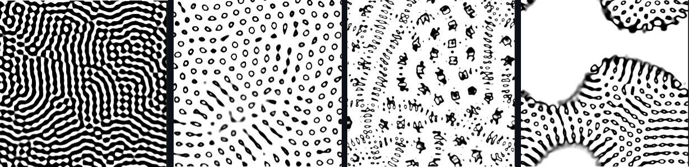
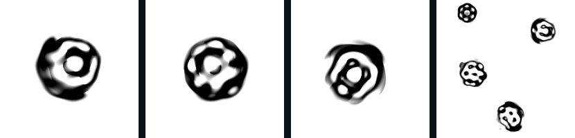
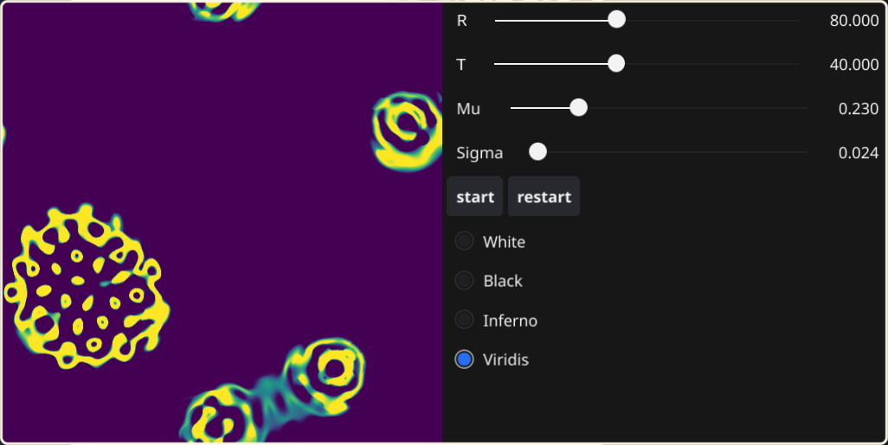

# Lenia in Go
An implementation of [Lenia](https://arxiv.org/pdf/1812.05433.pdf), the continuous Game of Life in Go.



Various static patterns or dynamic life-like shapes can emerge, depending on the parameters values.  

## Description
Learning Go with an implementation and display of Lenia system (based on a similar approach for [reaction-diffusion](https://github.com/NicolasDenier/reaction_diffusion)). The interface is made using the [fyne](https://developer.fyne.io/started/) package. The parameters can be tweaked with sliders during the simulation.

## Run
`go run simulation.go`  
Add `-h` for help, to see how to change the default parameters values:
```
-k display the kernel
-b string
    set the beta parameter as a string where the values   
    are separated by a comma (default "1,0.6,0.3")
-m float
    set the growth center (default 0.23)
-r float
    set the kernel radius (default 80)
-s float
    set the growth width (default 0.024)
-t float
    set the timeline (default 40)
```
## Controls
During the run, the parameters can be tweaked with sliders.  
Press `c` to close the window, or ctrl+C in terminal.  
Press`s` to take a screenshot.

Start/stop and restart buttons allow to manage the simulation.


Extra parameters such as window size can be changed in the source code. 
> Note: The FFT is way faster when the window size is $2^n$, default is 512.

## Kernel
As specified above, it is possible to display the kernel only with `-k`, this will be a static image:  


The number of rings and values of peaks depend on the beta (`-b`) parameter. For now, the kernel core function is exponential and can be change only by adding a new function in the source code.